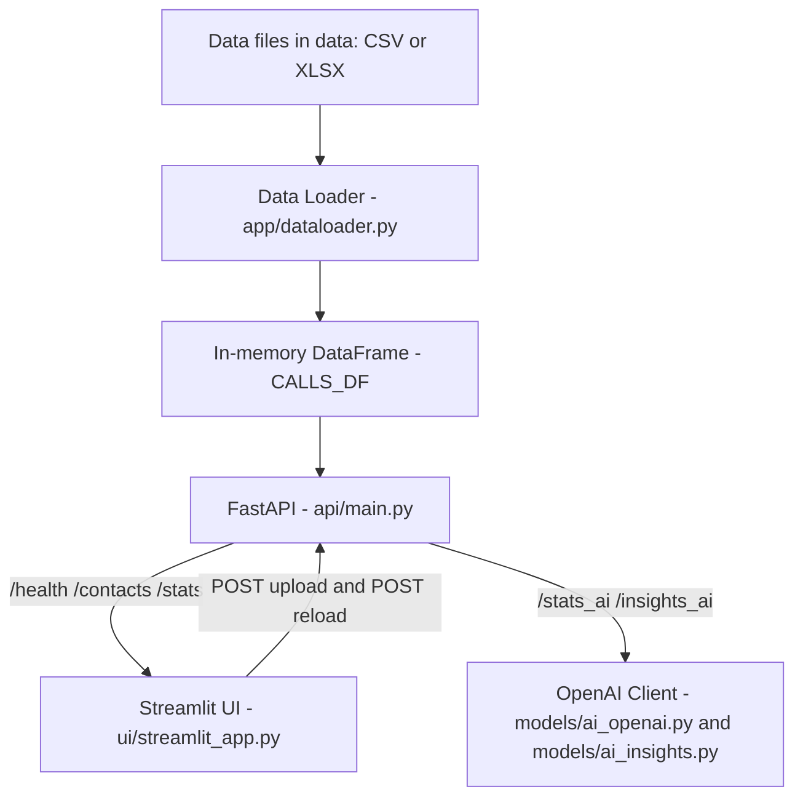

# 📞 Call Analytics App

Analyze call logs by **Main Contact** and **Associated Contact** with a **FastAPI** backend and a **Streamlit** dashboard.
Built for Pakistan MSISDN formats (but tolerant of mixed formats). Timezone: **Asia/Karachi**.

---

## ✨ What you get

* **Smart data loader (CSV/XLS/XLSX)**

  * Auto-detect A/B parties, start/end datetimes, duration, direction, call type
  * Phone normalization to MSISDN (e.g., `0xxx…` → `92xxx…`, `3xxx…` → `92xxx…`)
  * **Hex-to-label** decoding (e.g., `4A617A7A` → `Jazz`)
  * Apply **Asia/Karachi**; naive timestamps assumed **UTC** → converted to Karachi
  * Missing fields are inferred:

    * If `end_datetime` missing but `start_datetime` and `duration` exist → computed
    * If `duration` missing but `start/end` exist → computed
* **Unified schema**

  ```
  main_number, associated_number, associated_label, associated_key,
  start_datetime, end_datetime, duration_seconds,
  date, day_name, time, direction, call_type, source_file
  ```
* **API (FastAPI)**

  * `GET /health` — health + row count
  * `GET /contacts?main=…` — associated contacts with counts and % share
  * `GET /stats?main=…&associated=…` — filtered calls + aggregates
  * `GET /stats_ai?main=…&associated=…` — (optional) OpenAI-powered structured analysis
  * `GET /insights_ai?main=…&associated=…` — AI narrative insights *based on* simple model
  * `POST /upload` + `POST /reload` — add data file and refresh memory
* **UI (Streamlit)**

  * Enter **Main**; optionally filter by an **Associated** (phone or label)
  * **Mode toggle:** Simple (local analytics) or **AI (OpenAI)**
  * **Per-Date Summary**: call count, timings, per-call durations, total/avg duration, associated counts by date
  * Charts: Direction, Call Type, **Hourly (0–23 sorted)**, Duration histogram
  * KPI tiles: total/filtered calls, selected contact share, total/avg/median duration
  * **Upload** contacts via sidebar (to API) + one-click reload
  * Download CSVs: associated overview, per-date summary, filtered calls
  * If AI mode enabled: shows **all Simple outputs + AI Insights** at the end

---

## 🧭 Architecture



---

## 🗂 Project layout

```
call-analytics-app/
├─ api/
│  └─ main.py                   # FastAPI app (endpoints, models)
├─ app/
│  └─ dataloader.py             # Loader + normalization + compute_stats
├─ config/
│  └─ settings.py               # Centralized settings (reads env)
├─ models/
│  ├─ analytics.py              # Simple deterministic analytics (pandas)
│  ├─ ai_openai.py              # Structured OpenAI analytics (optional)
│  └─ ai_insights.py            # AI narrative insights from simple output
├─ ui/
│  └─ streamlit_app.py          # Streamlit dashboard (AI toggle included)
├─ data/                        # Your private data (gitignored)
├─ data-sample/                 # Optional small demo files
├─ requirements.txt
├─ .env.example                 # Example env file
├─ .gitignore
└─ README.md
```

---

## ⚙️ Setup (Windows)

### 1) Clone (or create) the project

```powershell
cd "C:\Users\centu\OneDrive\Desktop"
git clone https://github.com/<you>/call-analytics-app.git
cd call-analytics-app
```

### 2) Virtual environment

```powershell
python -m venv .venv
# If execution policy blocks activation, run once:
Set-ExecutionPolicy -Scope CurrentUser RemoteSigned
# activate
. .\.venv\Scripts\Activate.ps1
```

### 3) Install dependencies

```powershell
pip install --upgrade pip
pip install -r requirements.txt
```

If you don’t have `requirements.txt` yet:

```powershell
pip install fastapi uvicorn[standard] pandas openpyxl pytz requests pydantic streamlit python-dotenv openai
```

---

## 🔐 Environment (OpenAI optional)

Copy `.env.example` to `.env` and edit:

```env
# .env
# Backend data folder (defaults to ./data)
DATA_DIR=./data

# OpenAI (optional: required only for AI modes)
OPENAI_API_KEY=sk-xxx
OPENAI_MODEL=gpt-4o-mini
```

The app reads these via `config/settings.py`.

---

## ▶️ Run

### Start backend (FastAPI)

```powershell
uvicorn api.main:app --reload --port 8000
```

* Docs: [http://127.0.0.1:8000/docs](http://127.0.0.1:8000/docs)
* Health: [http://127.0.0.1:8000/health](http://127.0.0.1:8000/health)

### Start frontend (Streamlit)

Open a new terminal (with venv active):

```powershell
streamlit run ui/streamlit_app.py
```

* UI: [http://127.0.0.1:8501](http://127.0.0.1:8501)
* In the sidebar, make sure **API URL** points to `http://127.0.0.1:8000`.

---

## 📥 Add data

* Drop `.csv` / `.xlsx` / `.xls` files into **`data/`**.
  **File name should be the main number**, e.g., `923007087230.xlsx`.
* Or use **Streamlit → sidebar → Upload Contacts** to send the file to the API (`POST /upload`), then **/reload**.

**Recommended columns** (auto-detected even if named differently):

* A-party (caller): `a_number`, `a party`, `calling`, `from`, …
* B-party (callee): `b_number`, `b party`, `called`, `to`, …
* Start time: `datetime`, `date_time`, `start_time`, `call_time`, …
* End time: `end_time`, `end`
* Duration: `duration`, `call_duration`, `talk_time`
* Direction: `direction`, `call_direction`
* Type: `call_type`, `type`, `category`

Noisy fields (IMSI/IMEI/LAC/Cell/Lat/Lon…) are ignored.

---

## 🌐 API overview

### `GET /health`

```json
{"status":"ok","rows":12345}
```

### `GET /contacts?main=<msisdn>`

Associated contacts for the given main, with call counts and percent share.

```json
{
  "total_calls": 120,
  "contacts": [
    {"associated_key": "923001234567", "call_count": 38, "percent": 31.67},
    {"associated_key": "Jazz", "call_count": 25, "percent": 20.83}
  ]
}
```

### `GET /stats?main=<msisdn>[&associated=<phone-or-label>]`

Deterministic analytics (Simple model): filtered calls, KPIs, per-date summary, direction/type/hourly aggregates.

### `GET /stats_ai?main=<msisdn>[&associated=…]`

Structured analytics using OpenAI (optional). Same shape as simple model payload; falls back safely on errors.

### `GET /insights_ai?main=<msisdn>[&associated=…]`

Narrative **insights** based on the **simple** model output (so it never invents numbers).

### `POST /upload` + `POST /reload`

Upload a file to the backend and reload the in-memory dataset.

---

## 🖥️ Streamlit dashboard

* **Analysis Mode**:

  * **Analysis** → purely deterministic from `/stats`
  * **AI (OpenAI)** → everything from Analysis **plus** “AI Insights” section at the bottom
* **Per-Date Summary**: call count, timings, durations (each), total & average duration, associated counts per date
* **Charts**: Direction, Call Type, **Hourly** (always 0→23), Duration histogram
* **Downloads**: Associated overview, Per-date summary, Filtered calls

---

## 🧠 How AI is used (optional)

* **`/stats_ai` (models/ai_openai.py)**
  Structured Outputs or tool-calling to mirror the simple payload shape.
* **`/insights_ai` (models/ai_insights.py)**
  Takes the **simple model output**, condenses it, and asks OpenAI for succinct **markdown insights**.
  If OpenAI is not configured, the app continues in **Analysis** mode only.

> AI never fabricates records—it summarizes and highlights patterns already computed by the app.

---

## 🔒 Privacy

* **`data/`** is **gitignored** by default. Keep real logs private.
* Use `data-sample/` for demos.

---

## 🪛 Troubleshooting

* **Cannot activate venv on PowerShell**
  Run once:

  ```powershell
  Set-ExecutionPolicy -Scope CurrentUser RemoteSigned
  ```
* **Streamlit cannot reach API**
  Start FastAPI first and set the **API URL** in the sidebar.
* **“Out of range float values are not JSON compliant”**
  We sanitize NaN/Inf in API responses; if you extended endpoints, ensure you `jsonable_encoder` and sanitize NaN/Inf→`None`.
* **OpenAI errors**
  Check `.env` has `OPENAI_API_KEY` and valid `OPENAI_MODEL`. The app falls back to Analysis mode automatically.

---

## ✅ Ready

* Start **API** → `uvicorn api.main:app --reload --port 8000`
* Start **UI** → `streamlit run ui/streamlit_app.py`
* Upload or drop files to **data/** → Explore! 🎉

---
